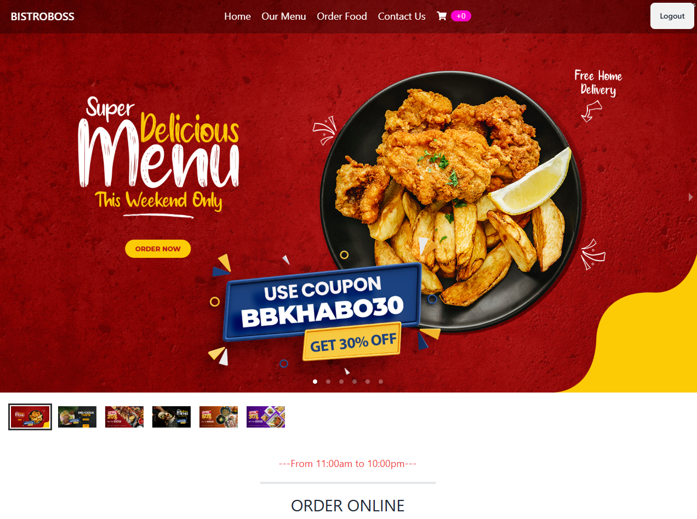

# BistroBoss - Restaurant Website

BistroBoss is a fully responsive restaurant website with two parts: User and Admin. It provides a seamless and secure experience for users to browse and order food, while giving the admin control over managing food items and users.




## Features

### User Features
- **View Cart**: Users can see the list of food items added to their cart.
- **Delete Cart Items**: Users can remove items from the cart.
- **Place Orders**: Users can place food orders for delivery or pickup.
- **Login & Registration**: Users can sign up and log in using email or Google (via Firebase).
- **Secure Payment**: Users can complete payments using Stripe or SSLCommerz.

### Admin Features
- **Manage Menu Items**: Admin can add, update, or delete food items.
- **Manage Users**: Admin can view all users, promote users to admin, or delete users.

### Security
- **JWT Token**: Secure authentication using JWT tokens stored in local storage.

## Technologies Used

### Frontend
- **React.js**: For building a responsive and interactive UI.
- **HTML**: For structuring the web pages.
- **Tailwind CSS**: For modern, utility-first CSS styling.
- **DaisyUI**: For UI components built on top of Tailwind CSS.
- **SweetAlert**: For showing alert messages with a better user experience.
- **Toast**: For displaying toast notifications.

### Backend
- **Firebase**: For user authentication (Email/Google).
- **MongoDB**: For storing food items, users, and orders.
- **Node.js**: For the backend server.
- **Express.js**: For handling HTTP requests and API endpoints.
- **Stripe Payment Gateway**: For processing secure online payments.
- **SSLCommerz Payment Gateway**: For handling local transactions in Bangladesh.

### Security
- **JWT Tokens**: User authentication and authorization using JSON Web Tokens.

### Testing Account
- **Admin Access**:
- **Email**: Admin@gmail.com
- **Password**:  Admin1@

## Live Link
[Visit BistroBoss](https://bistro-boss-86203.web.app/)

## Backend GitHub Link
[Backend GitHub Repository](https://github.com/IsmotaraDipty43/Resturant-mangment-website-Server-side)

## 🛠 How to Run the Project Locally

Follow these steps to set up and run the project on your local machine using **VS Code**.

1️⃣ **Clone the Repository**  
   git clone https://github.com/IsmotaraDipty43/Resturant-Management-Client-Full-Stack 

2️⃣ **Navigate to the Project Folder**  
   cd bistro-boss-client-project  

3️⃣ **Open the Project in VS Code**  
   code .  

4️⃣ **Install Dependencies**  
   npm install  

5️⃣ **Set Up Environment Variables**  
   - Add required environment variables (e.g., API keys, database URLs)  

6️⃣ **Run the Development Server**  
   npm run dev  
   
## 📦 Dependencies Used  
Below are the key dependencies used in this project:  

```json
{
  "dependencies": {
    "react": "^18.2.0",
    "react-router-dom": "^6.11.2",
    "tailwindcss": "^3.0.0",
    "firebase": "^9.6.1",
    "stripe": "^8.0.0",
    "axios": "^1.3.4",
    "jsonwebtoken": "^9.0.0",
    "express": "^4.18.2",
    "mongoose": "^6.9.1",
    "sweetalert2": "^11.3.4",
    "react-toastify": "^9.0.1",
    "cors": "^2.8.5",
    "dotenv": "^16.0.3",
    "daisyui": "^1.20.0",
    "sslcommerz-node": "^1.0.0"
  }
}


